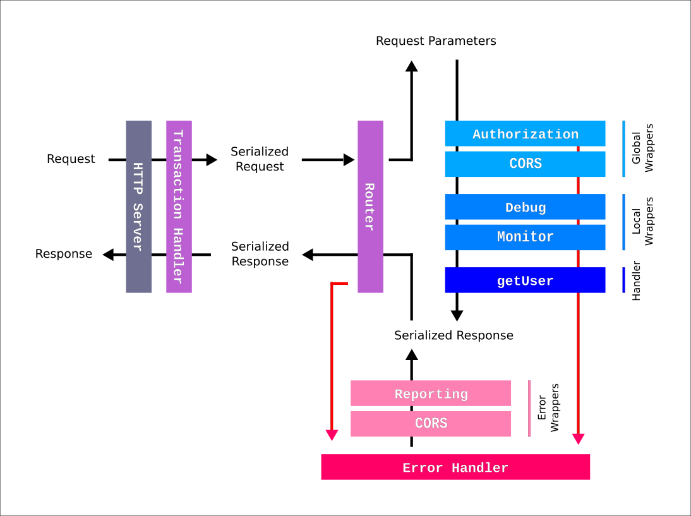

[//]: # ( )
[//]: # (This file is automatically generated by the `jsarch`)
[//]: # (module. Do not change it elsewhere, changes would)
[//]: # (be overriden.)
[//]: # ( )
# Architecture Notes


## Principles

The `swagger-http-router` projects aims to make
 creating well documented and highly customizable
 REST APIs a breeze.

By relying on the
 [Swagger/OpenAPI format](https://www.openapis.org/)
 to declare a new endpoint, this project forces
 documentation before code.

It also is highly customizable since based
 on the dependency injection with inversion of
 control pattern allowing you to override or
 wrap its main constituents.



The HTTP transaction flow is very simple.
 First, we have a HTTPServer that handles
 requests an serve responses (the
 `httpServer` service). Then, the
 `httpTransaction` transform the NodeJS
 requests into raw serialazable ones
 (raw objects with no methods nor
 internal states).

 Then the router (`httpRouter`) deal with
 that request to test which handler need
 to be run by comparing the method/path
 couple with the Swagger/OpenAPI operations
 declarations.

 Once found, it simply runs the right
  handler with the Swagger/OpenAPI
  parameters value filled from the
  serializable request. The handler
  simply have to return a serializable
  response object in turn.

  If any error occurs within
  this process, than the `errorHandler`
  is responsible for providing the now
  lacking response object based on the
  error it catch. And that's it, you
  have your REST API.

  We have [no middleware](http://insertafter.com/en/blog/no_more_middlewares.html)
  concept here. Instead, every handler
  is a simple function taking an object
  and returning another one. It makes
  those objects very easily composable
  (in a functional programming sense).

  You may add global wrappers to
  change every handlers input/output
  on the fly or add a local wrapper
  specifically to one of a few
  handlers.

[See in context](./src/index.js#L15-L74)


## HTTP Router

The `httpRouter` service is responsible for handling
 the request, validating it and wiring the handlers
 response to the actual HTTP response.

It is very opiniated and clearly diverges from the
 current standards based on a middlewares/plugins
 approach.

Here, the single source of truth is your API
 definition. No documentation, no route.

[See in context](./src/router.js#L40-L51)


## HTTP Server

The `httpServer` service is responsible for instanciating
 the httpServer and handling its start/shutdown.

[See in context](./src/server.js#L6-L9)


### Request body

According to the Swagger/OpenAPI specification
there are two kinds of requests:
- **validated contents:** it implies to
 buffer their content and parse them to
 finally validate it. In that case, we
 provide it as a plain JS object to the
 handlers.
- **streamable contents:** often used
 for large files, those contents must
 be parsed and validated into the
 handler itself.

[See in context](./src/body.js#L5-L17)


### Validators

For performance reasons, the validators are
 created once for all at startup from the
 API definition.

One could argue that it would have been
 better for performances to generate
 the code statically. This is true. It
 may be done later but it won't change
 the way it works so, moving fast for
 now but keeping it in mind.

Also, looking closely to Prepack that
 could improve significantly this
 project performances with close to no
 time costs:
 https://github.com/facebook/prepack/issues/522#issuecomment-300706099

[See in context](./src/validation.js#L4-L21)


## HTTP Transactions

The `httpTransaction` service create a new transaction
 for every single HTTP request incoming. It helps
 ensuring each request receives a response and avoid
 idle requests via a configurable timeout.

It is also a convenient abstraction of the actual
 request/response between the router and
 the NodeJS world. A common need is to fake the
 HTTP method for backward compatibility with old
 browsers/proxies by using the
 `X-HTTP-Method-Override` header.

You could simply do this by wrapping this service
 like so:
```js
import { initHTTPTransaction } from 'swagger-http-router';
import { wrapInitializer } from 'knifecycle/dist/util';

export const initHTTPTransactionWithMethodOverride =
  wrapInitializer(async (services, httpTransaction) => {
  return async (...args) => {
    const [request, transaction] = httpTransaction(...args);

    return [{
      ...request,
      method: request.headers['x-http-method-override'] ?
        request.headers['x-http-method-override'].toLowerCase() :
        request.method,
      headers: Object.keys(req.headers)
        .filter(
          headerName =>
          'x-http-method-override' === headerName
        )
        .reduce((newHeaders, headerName) => {}, {
          newHeaders[headerName] = req.headers[headerName];
          return newHeaders;
        })
    }, httpTransaction];
  };
}, initHTTPTransaction);
```

[See in context](./src/transaction.js#L14-L56)


### New Transaction

The idea is to maintain a hash of each pending
 transaction. To do so, we create a transaction
 object that contains useful informations about
 the transaction and we store it into the
 `TRANSACTIONS` hash.

Each transaction has a unique id that is either
 generated or picked up in the `Transaction-Id`
 request header. This allows to trace
 transactions end to end with that unique id.

[See in context](./src/transaction.js#L123-L134)


### Transaction start

Once initiated, the transaction can be started. It
 basically spawns a promise that will be resolved
 to the actual response or rejected if the timeout
 is reached.

[See in context](./src/transaction.js#L192-L197)


### Transaction errors

Here we are simply casting and logging errors.
 It is important for debugging but also for
 ending the transaction properly if an error
 occurs.

[See in context](./src/transaction.js#L207-L212)


### Transaction end

We end the transaction by writing the final status
 and headers and piping the response body if any.

The transaction can till error at that time but it
 is too late for changing the response status so
 we are just logging the event.
 This could be handled with
 [HTTP trailers](https://nodejs.org/api/http.html#http_response_addtrailers_headers)
 but the lack of client side support for now is
 preventing us to use them.

 Once terminated, the transaction is removed
  from the `TRANSACTIONS` hash.

[See in context](./src/transaction.js#L234-L248)

